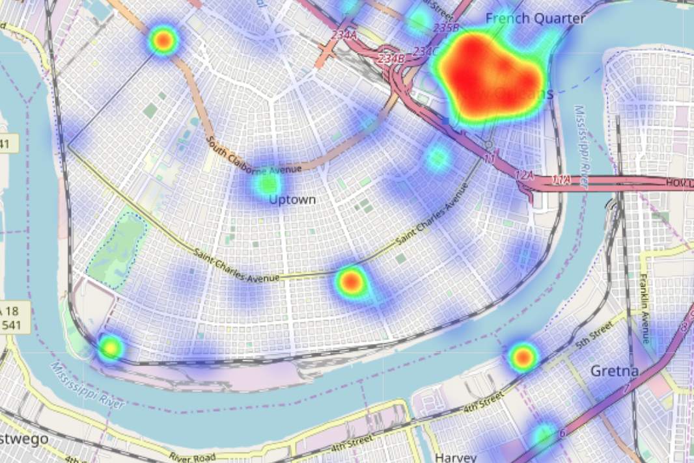
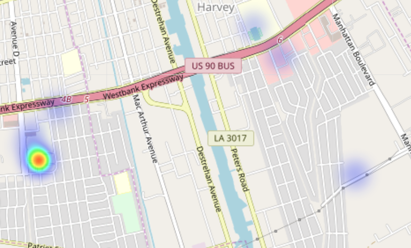
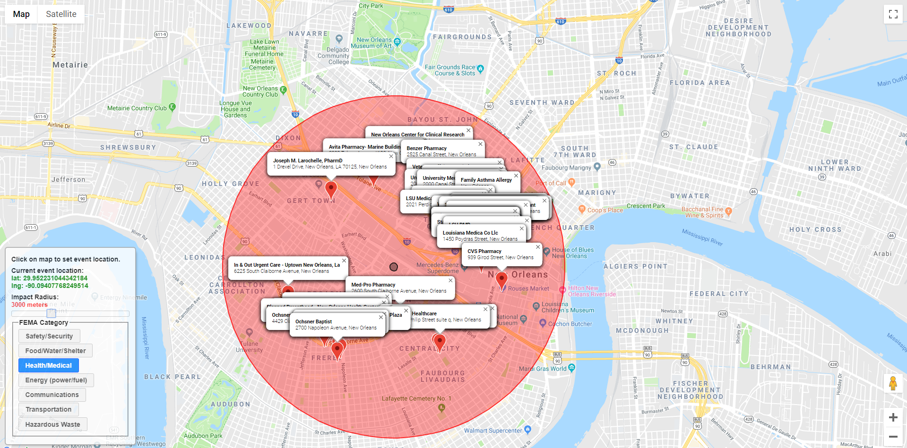

# Project 5
## Problem Statement
In the event of a disaster, it is essential that goverment and private forces rapidly identify potential threats and communicate damage and rescue efforts effectively. The Federal Emergency Management Agency, known as FEMA, has developed a list of seven lifelines which represent establishments most essential to supporting human populations during times of crisis. The lifelines are as follows: safety and security; food, water, and sheltering; health and medical; energy; communications; transportation; and hazardous waste. With these seven lifelines in mind, our study was conducted for New Light Technologies with two goals:

  - build a tool that takes in a latitude,longitude coordinate and returns the lifelines in the affected area
  - predict the potential impact of a disaster to the lifelines

## Data Dictionary
|Feature|Type|Dataset|Description|
|-------|----|-------|-----------|
|FEMA Lifeline|string|full_dataset.csv|Description of one of FEMA's seven lifelines.|
|geometry|dictionary|full_dataset.csv|Multiple variations on latitude and Longitude information about a location.|
|name|string|full_dataset.csv|Name of business or location.|
|types|string|full_dataset.csv|Google categorical type.|
|vicinity|string|full_dataset.csv|Address of location.|
|lat|float|full_dataset.csv|Latitude of location.|
|lng|float|full_dataset.csv|Longitude of location.|
|Website_FEMA|int|full_dataset.csv|Numeric representation FEMA categorical lifelines.|

## Repository Structure
- code: contains all of the code files for evaluating the data and creating and running the tool for FEMA
- datasets: contains all of the data collected from the api 
- google_api_work:contains the code for using the google api
- images
- README

## Executive Summary  

New Light Technologies has tasked our team with creating a tool to identify vulnerable areas in a community and project possible effects if a disaster event were to hit that area. The metrics we used to estimate community vunlerablility are the status of the seven lifelines provided by FEMA. These metrics were established after multiple large scale disasters in 2017. "...[T]he lifeline construct can help responders and decision-makers rapidly determine the scope, complexity, and interdependent impacts of an incident."[2]   

Our group decided to use Google Maps and the Google Place Search API to locate places that may fall into one of the seven lifeline categories. We chose Google Maps over other sources like Yelp, due in part to the fact that Google provides many more businesses than Yelp's API. New Orleans was picked as our prototype city due to its history of severe weather. Using the Google API, we wrote a function in order to pull businesses within a specified radius of a user-inputed latitude and longitude. Each business has a corresponding categorical "type" assigned by Google: this was used to determine into which of the seven lifelines each business would fall.[3] Useful information pulled from the Google API included: business name, address, type, and latitude/longitude. This information did have to be re-engineered in order to be used with our classification and clustering algorithms.

In the early stages of this study, we outlined the data that would be most important for FEMA if a natural disaster were to hit. We determined there are two stages of a disaster preparedness plan that we found important:

The first stage is a preemptive look at what areas of a given location are already in danger of low lifeline support. We tried to accomplish this task by using KMeans clustering; however, an un-clustered heatmap of lifeline-businesses proved to be more representational in this context. Given this, FEMA can put in place support systems for when/if an event occurs. Based on our model you can see below the areas in New Orleans that have high concentrations of specific lifelines.

As expected the highest concentration of lifelines is in the downtown area. Nevertheless, it is worth noting the other areas in which there are concentrations in the surrounding areas. In preparing for possible natural disasters it is suggested that FEMA consider these locations as highly vulnerable.

The second stage is a reactionary approach to an event shortly after it begins. We created a tool that takes the event (disaster) center and radius as inputs and returns the lifelines and totals of their respective categories within that area. The lifelines are ordered by proximity to the event center, so the operator can make assumptions about which may be affected depending on the type of disaster. In order to determine proximity from a central event center, each lifeline's distance was calculated using a function utilizing latitude and longitude. This infomation can then be visualized for the user in multiple ways. Looking at the heatmap, the user can also see how individual lifelines are distributed in a given area.

In addition to the tool located in the Jupyter Notebooks, as an end user tool, a web app was built to allow for a quick view of businesses within a specified radius of the selected event center, filtered by FEMA category. The web app runs entirely in the browser with no server-side coding needed and utilizes json-format files generated from our models, consumed and processed by Javascript and HTML. Below is an image of the capabilities of the online tool.  

- Dataset found: https://www.ncdc.noaa.gov/stormevents/ftp.jsp

## Results

The scope of this project was to 1) predict the locations of highest lifeline density and 2) create a lifeline monitoring tool for the city of New Orleans - both serving as proof of concept for any location. These objectives were met by our project, as demonstrated by the functioning website and project notebooks.

## Limitations and Next Steps

While collecting data, it was realized that the Google Places API sets a hard limit at 60 businesses per request. Although we were able to compensate for this fact by increasing the number of business types including in our model, we do not believe we were able to attain 100% of lifeline-businesses within the city of New Orleans.

Ideas for future research and modeling, for which we did not have the time nor budget, includes the inclusion of population density as a feature to predict the number of people affected by the diaster. Also, we noticed that several business that exist in close proximity to others businesses of similar nature may be inflating lifeline-density in certain areas. As for knowing the status of a lifeline, there does not appear to be an efficient way to gather that live data. Response organizations may want to consider partnering with companies that appeal to a large audience to develop a prototype that could aid in the collection of real-time closures for areas at high risk.

## Resources
[1] https://www.fema.gov/media-library-data/1543953591582-d3437147e8954b5c9b8469dc2d173531/Revised_Community_Lifelines_Information_Sheet.pdf  
[2] https://www.fema.gov/media-library-data/1550596625129-99b1671f270c18c934294a449bcca3ce/Tab2a.CommunityLifelinesToolkitPresenterGuide_508.pdf  
[3] https://developers.google.com/places/web-service/supported_types  

